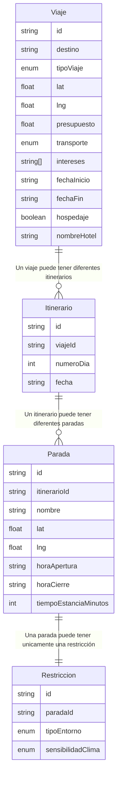

# Diagrama Entidad-Relación del proyecto Guía Turistica.

En este archivo les comparto las entidades que se han creado, sus tipos de datos y su respectiva relación. Esto como base para cuando se cree lo de las migraciones de las bases de datos, por si tienen dudas de como se relaciona cada modelo

